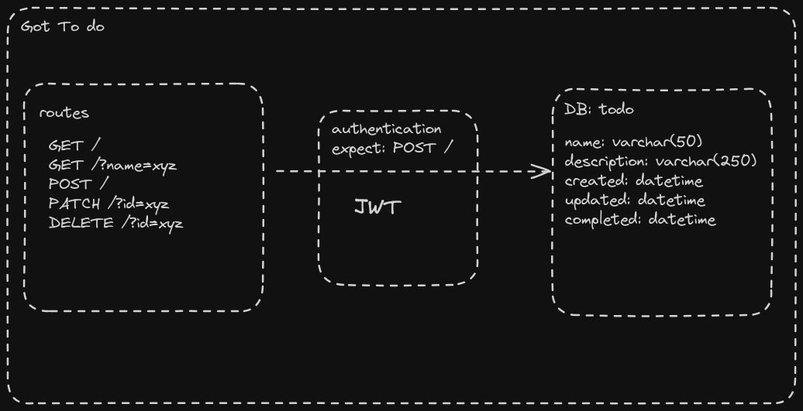

# Got To DO

A to-do app service.
The flow is as follows:

- Routes handle requests for creating, retrieving, updating, and deleting to-do items.
- Authentication via JWT is required to access these routes(except the create).
- Operations on the to-do items are performed in the database, interacting with the specified fields.

## Sample High-Level Idea

## Libraries and usage

- used Typescript for type safety.
- Express for server creation.
- JWT is used for the authorization of resources.
- Zod for body validation.
- Mongoose for easy connection and mutation to MongoDB.

## !IMPORTANT

- while creating the todo, there is a need to provide "username"; "John" or "Jane".
- for simplicity, I have the logic to handle only two usernames.
